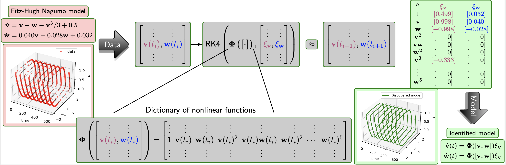

# Discovery of Nonlinear Dynamical Systems using a Runge-Kutta Inspired Dictionary-based Sparse Regression Approach

This repository contains the Python implementation using the PyTorch framework to discover nonlinear dynamical system using a Runge-Kutta Inspired Distionary-based sparse regression approach. The methodology is depicted in the figure below.

     
The method combines machine learning (dictionary-based) with a numerical integration scheme, namely a Runge-Kutta scheme to discover governing equations using corrupted and sparsely-sampled data. The method does not require the computation of derivative information to discover governing equations. Hence, it holds a key advantage when data are corrupted and sparsely sampled. 

The important steps of the methodology are:

1. Collect measurement data  
2. With empricial knowledge, build a symbolic dictionary
3. Set-up an optimization problem by incorportating the fourth-order Runge-Kutta scheme
4. Solve the optimization problem using gradient-decent 
 	
we utilize automatic differentiation implemented in PyTorch. To promote sparity in the solution, we employ sequential thresholding, for instance proposed in [2]. 

## Contains
* `Dictionary`folder contains functions that build symbolic dictionary. 
* `Examples` folder contains all the examples considered in the paper. The results generated from these examples will be saved in the Result folder. 
* `Functions` contains externalized Python routines, e.g., solving sparsity-promiting optimization problem. 

## Dependencies
For reproducibility, we have stored all dependencies and their versions in `environment.yml`. An virtual enviornment, namely `RK4_SINDy` can be created using `conda` by using `conda env create -f environment.yml`. 

## Licenese
See the [LICENSE](LICENSE) file for license rights and limitations (MIT).

## References
[1]. P. Goyal, and P. Benner, [Discovery of Nonlinear Dynamical Systems using a Runge-Kutta Inspired Dictionary-based Sparse Regression Approach](https://arxiv.org/abs/2105.04869), arXiv:2105.04869, 2021.

BibTeX
<pre>
@TechReport{morGoyB21a,
  author =       {Goyal, P. and Benner, P.},
  title =        {Discovery of Nonlinear Dynamical Systems using a {R}unge-{K}utta Inspired Dictionary-Based Sparse Regression Approach},
  institution =  {arXiv},
  year =         2021,
  type =         {e-print},
  number =       {2105.04869},
  url =          {https://arxiv.org/abs/2105.04869},
  note =         {cs.LG}
}
</pre>

[2]. B. M. de Silva, K. Champion1, M. Quade, J. C. Loiseau, J. N. Kutz, and S. L. Brunton, [PySINDy: A Python package for the sparse identification of nonlinear dynamical systems from data](https://joss.theoj.org/papers/10.21105/joss.02104). Journal of Open Source Software, 5(49), 2104, 2020.

BibTeX
<pre>
@article{desilva2020,
doi = {10.21105/joss.02104},
url = {https://doi.org/10.21105/joss.02104},
year = {2020},
publisher = {The Open Journal},
volume = {5},
number = {49},
pages = {2104},
author = {Brian de Silva and Kathleen Champion and Markus Quade and Jean-Christophe Loiseau and J. Kutz and Steven Brunton},
title = {PySINDy: A Python package for the sparse identification of nonlinear dynamical systems from data},
journal = {Journal of Open Source Software}
}
</pre>

[3]. P., Adam et al., [PyTorch: An Imperative Style, High-Performance Deep Learning Library](http://papers.neurips.cc/paper/9015-pytorch-an-imperative-style-high-performance-deep-learning-library.pdf). Advances in Neural Information Processing Systems, pp. 8024--8035, 2019.

BibTeX
<pre>
@incollection{NEURIPS2019_9015,
title = {PyTorch: An Imperative Style, High-Performance Deep Learning Library},
author = {Paszke, Adam and Gross, Sam and Massa, Francisco and Lerer, Adam and Bradbury, James and Chanan, Gregory and Killeen, Trevor and Lin, Zeming and Gimelshein, Natalia and Antiga, Luca and Desmaison, Alban and Kopf, Andreas and Yang, Edward and DeVito, Zachary and Raison, Martin and Tejani, Alykhan and Chilamkurthy, Sasank and Steiner, Benoit and Fang, Lu and Bai, Junjie and Chintala, Soumith},
booktitle = {Advances in Neural Information Processing Systems 32},
editor = {H. Wallach and H. Larochelle and A. Beygelzimer and F. d\textquotesingle Alch\'{e}-Buc and E. Fox and R. Garnett},
pages = {8024--8035},
year = {2019},
publisher = {Curran Associates, Inc.},
url = {http://papers.neurips.cc/paper/9015-pytorch-an-imperative-style-high-performance-deep-learning-library.pdf}
}
</pre>

